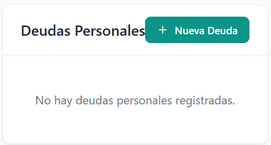

<div align="center">

# 🏠 Aplicación de Gestión de Gastos de Comunidad

[](https://reactjs.org/)
[](https://www.typescriptlang.org/)
[](https://vitejs.dev/)
[](https://www.php.net/)
[](https://www.mysql.com/)

<p>Una aplicación web moderna para gestionar gastos de comunidad, con exportación a Excel y visualización de datos.</p>

</div>

## 📸 Capturas de Pantalla

<div align="center">


  


### Dashboard con Deudas Personales


</div>

## 💻 Panel de Administración

El Panel de Administración proporciona herramientas potentes para gestionar la base de datos de la aplicación:

### Funciones Principales

- **🔄 Restaurar Categorías**: Restablece las categorías predeterminadas en caso de que hayan sido eliminadas o modificadas accidentalmente.

- **🗑️ Eliminar Transacciones Antiguas**: Permite eliminar automáticamente todas las transacciones con más de un año de antigüedad, ayudando a mantener la base de datos limpia y eficiente.

- **💾 Optimizar Base de Datos**: Ejecuta comandos de optimización en las tablas de la base de datos para mejorar el rendimiento general de la aplicación.

- **🗑️ Limpiar Base de Datos**: Elimina todos los registros de transacciones mientras preserva las tablas de usuarios, categorías **y deudas personales**. Esta función es útil para reiniciar la aplicación manteniendo la configuración básica y las deudas personales.

  > ⚠️ **Advertencia:** La limpieza de la base de datos NO elimina las deudas personales almacenadas en la tabla `personal_debts`. Si deseas borrar también las deudas personales, deberás hacerlo manualmente desde la sección de deudas o mediante una consulta SQL específica.

### Seguridad

El acceso al Panel de Administración está protegido por autenticación, asegurando que solo los usuarios autorizados puedan realizar estas operaciones críticas.

## ✨ Características

- 💰 **Gestión de Gastos**: Registra y gestiona gastos de comunidad para casa y garaje
- 📁 **Categorización**: Organiza los gastos en diferentes categorías (Gastos, Extras, Deudas)
- 📈 **Visualización de Datos**: Gráficos interactivos para visualizar la distribución de gastos
- 📆 **Exportación a Excel**: Exporta los datos a Excel con formato mejorado (deudas en rojo)
- 👥 **Gestión de Deudas Personales**: Seguimiento de deudas personales con visualización en el dashboard
- 🔐 **Control de Acceso**: Interfaz diferenciada para administradores y usuarios normales
- 🚀 **Ejecutable Integrado**: Lanzador con icono personalizado para fácil ejecución

## 💻 Tecnologías Utilizadas

### Frontend
- ⚡️ React 18.3
- 🔥 TypeScript 5.0
- ⚡ Vite 5.4
- 📊 Chart.js 4.4
- 🎨 TailwindCSS 3.4
- 📊 XLSX 0.18

### Backend
- 🔗 PHP 8.2
- 💾 MySQL 8.0
- 🌐 RESTful API

### Integración de Escritorio
- 💻 Tauri 2.5.0 (opcional)
- 💼 PowerShell (lanzador incluido)

## 📦 Requisitos Previos

- 🔍 Node.js (v14 o superior)
- 🔎 XAMPP (o cualquier servidor con PHP y MySQL)
- 💻 Navegador web moderno

## 📍 Instalación

### 1. Clona el repositorio

```bash
git clone [URL del repositorio]
cd gastos
```

### 2. Instala las dependencias

```bash
npm install
```

### 3. Configura la base de datos

1. Inicia XAMPP y asegúrate de que los servicios Apache y MySQL estén funcionando
2. Abre phpMyAdmin (http://localhost/phpmyadmin)
3. Crea una nueva base de datos llamada `gastos_app`
4. Importa el esquema de la base de datos desde `database/schema.sql`

### 4. Configura la conexión a la base de datos

Edita el archivo `api/config.php` si es necesario para ajustar los parámetros de conexión:

```php
<?php
// Configuración de la base de datos
define('DB_HOST', 'localhost');
define('DB_NAME', 'gastos_app');
define('DB_USER', 'root');
define('DB_PASS', '');
?>
```

## 🚀 Uso

### ⚡️ Build y despliegue correcto del frontend (React + Vite)

Para que los cambios en el frontend se reflejen correctamente en producción, sigue estos pasos:

1. **Restaurar el `index.html` para desarrollo**
   - Antes de hacer el build, asegúrate de que tu `index.html` en la raíz tenga solo la referencia al punto de entrada de React:
   ```html
   <script type="module" src="/src/main.tsx"></script>
   ```
   - No debe tener referencias directas a archivos de `assets` con hash.

2. **Ejecutar el build**
   - En la raíz del proyecto, ejecuta:
   ```bash
   npm run build
   ```
   - Esto generará los archivos finales en la carpeta `dist`.

3. **Copiar los archivos generados a la raíz**
   - Copia el `dist/index.html` y la carpeta `dist/assets` a la raíz del proyecto (`d:\xampp\htdocs\gastos`), sobrescribiendo los archivos antiguos.
   - La estructura final debe ser:
     ```
     gastos/
     ├── index.html      # generado por el build
     ├── assets/         # carpeta generada por el build
     ├── api/
     └── ...otros archivos
     ```

4. **Refresca la página**
   - Ve a `http://localhost/gastos/` y verás la versión actualizada de la aplicación.

---

### Usando el Lanzador (Recomendado)

La aplicación incluye un lanzador ejecutable que facilita su ejecución en diferentes modos:

1. Ejecuta el archivo `GestionGastos.exe` haciendo doble clic en él.

2. Se abrirá una interfaz gráfica con icono personalizado que muestra el estado de los servicios de XAMPP.

3. Elige uno de los modos de ejecución:

   - **Modo XAMPP**: Abre la aplicación en la ruta donde hayas colocado el proyecto (por ejemplo, `http://localhost/[carpeta-del-proyecto]/`). Requiere que los servicios Apache y MySQL estén en ejecución.
   
   - **Modo Desarrollo**: Inicia automáticamente el servidor de desarrollo con Vite y abre la aplicación en el puerto asignado. No depende de XAMPP para el desarrollo.

> **Nota**: El ejecutable detecta automáticamente la carpeta donde está instalado el proyecto y construye las URLs correctamente.

### Desarrollo Manual

1. Inicia el servidor de desarrollo:

```bash
npm run dev
```

2. Abre tu navegador y ve a la URL mostrada en la consola (normalmente algo como):

```
http://localhost:5173/
```

> **Nota**: El puerto puede variar en cada ejecución. Observa la consola para ver la URL exacta.

### Producción

1. Construye la aplicación para producción:

```bash
npm run build
```

2. Configura tu servidor web:
   - Copia todos los archivos de la carpeta `dist` a la raíz de tu servidor web o a una subcarpeta
   - Copia la carpeta `api` completa al mismo nivel que los archivos de la carpeta `dist`
   - Asegúrate de que el servidor web tenga permisos de escritura en la carpeta `api`

## 🔄 Cambiar la carpeta o ruta del proyecto

Esta aplicación está diseñada para funcionar correctamente independientemente de la carpeta donde se coloque. El ejecutable `GestionGastos.exe` detecta automáticamente la ubicación del proyecto y configura las rutas adecuadamente. Sin embargo, hay algunos aspectos importantes a considerar:

### 1. Mover los archivos del proyecto

1. Copia toda la carpeta del proyecto a la nueva ubicación deseada dentro de la carpeta `htdocs` de XAMPP.

### 2. Configurar el acceso a la API

La aplicación utiliza un sistema de redirección para acceder a la API desde cualquier ubicación:

1. **Carpeta de redirección en la raíz del servidor web**
   - Una carpeta llamada `api` en la raíz del servidor web (por ejemplo, `D:\xampp\htdocs\api`)
   - Contiene un archivo `index.php` que redirige todas las solicitudes a la carpeta real de la API
   - Este sistema permite que la aplicación funcione sin modificar su código interno

   ```php
   <?php
   // Redirige todas las solicitudes a la carpeta gastos/api
   $request_uri = $_SERVER['REQUEST_URI'];
   $path = parse_url($request_uri, PHP_URL_PATH);
   
   // Eliminar '/api' del principio del path
   $new_path = preg_replace('/^\/api/', '/gastos/api', $path);
   
   // Construir la nueva URL
   $protocol = isset($_SERVER['HTTPS']) && $_SERVER['HTTPS'] === 'on' ? 'https' : 'http';
   $host = $_SERVER['HTTP_HOST'];
   $new_url = "$protocol://$host$new_path";
   
   // Redirigir a la nueva URL
   header("Location: $new_url", true, 307);
   exit;
   ?>
   ```

2. **Configuración automática**
   - El ejecutable `GestionGastos.exe` detecta automáticamente la ubicación del proyecto
   - Abre la aplicación con las rutas correctas sin necesidad de configuración manual

### 3. Ejecutar la aplicación

Una vez configurado, simplemente ejecuta el archivo `GestionGastos.exe` o `GestionGastos.bat` desde la nueva ubicación. El ejecutable detectará automáticamente la carpeta donde está instalado y construirá las URLs correctamente.
     ```

4. Configura el servidor web:
   - Para Apache, asegúrate de que el módulo `mod_rewrite` esté habilitado
   - Crea o edita un archivo `.htaccess` en la raíz de tu aplicación con el siguiente contenido:
     ```apache
     <IfModule mod_rewrite.c>
       RewriteEngine On
       RewriteBase /
       RewriteRule ^index\.html$ - [L]
       RewriteCond %{REQUEST_FILENAME} !-f

## 📚 Estructura del Proyecto

```
gastos/
├── api/                      # Backend PHP
│   ├── admin/                # Funciones de administración
│   │   ├── check-auth.php      # Verificación de autenticación
│   │   ├── delete-old-transactions.php # Eliminar transacciones antiguas
│   │   ├── login.php           # Inicio de sesión de administrador
│   │   ├── optimize-database.php # Optimización de la base de datos
│   │   ├── restore-categories.php # Restaurar categorías predeterminadas
│   │   └── simple-clear-db.php  # Limpiar la base de datos
│   ├── config/               # Configuración de la base de datos
│   │   ├── config.php         # Configuración general
│   │   └── database.php       # Configuración de conexión a la BD
│   ├── models/               # Modelos de datos
│   │   ├── Category.php       # Modelo para categorías
│   │   └── Expense.php        # Modelo para gastos
│   ├── categories.php        # API de categorías
│   ├── expenses.php          # API de gastos
│   └── index.php             # Punto de entrada de la API
├── src/                      # Frontend React
│   ├── components/           # Componentes React
│   │   ├── admin/             # Componentes de administración
│   │   │   ├── AdminPanel.tsx    # Panel de administración
│   │   │   ├── AdminTransactionList.tsx # Lista de transacciones (admin)
│   │   │   └── LoginModal.tsx    # Modal de inicio de sesión
│   │   ├── expenses/           # Componentes de gastos
│   │   │   ├── ExpenseForm.tsx   # Formulario de gastos
│   │   │   └── ExpenseList.tsx   # Lista de gastos
│   │   ├── layout/             # Componentes de diseño
│   │   │   └── Header.tsx        # Barra de navegación
│   │   └── ui/                 # Componentes de UI reutilizables
│   │       ├── Button.tsx        # Botón personalizado
│   │       ├── Card.tsx          # Tarjeta
│   │       └── Loading.tsx       # Indicador de carga
│   ├── context/              # Contextos de React
│   │   ├── AuthContext.tsx    # Contexto de autenticación
│   │   └── ExpenseContext.tsx # Contexto de gastos
│   ├── utils/                # Utilidades
│   │   ├── api.ts             # Cliente API
│   │   └── helpers.ts         # Funciones auxiliares
│   ├── views/                # Vistas principales
│   │   ├── Dashboard.tsx      # Vista del panel
│   │   ├── Transactions.tsx   # Vista de transacciones
│   │   └── Charts.tsx         # Vista de gráficos
│   ├── App.tsx               # Componente principal
│   ├── main.tsx              # Punto de entrada
│   └── vite-env.d.ts         # Tipos de Vite
├── dist/                     # Archivos compilados
├── public/                   # Archivos estáticos
├── .env                      # Variables de entorno
├── index.html               # HTML principal
├── index.php                # Enrutador PHP
├── package.json             # Dependencias npm
├── tsconfig.json           # Configuración TypeScript
├── vite.config.ts          # Configuración Vite
├── GestionGastos.exe       # Ejecutable de la aplicación con icono personalizado
├── launcher.ps1            # Script de inicio PowerShell
└── dashboard-with-debts.html # Dashboard alternativo con visualización de deudas personales
```

## 💯 Funcionalidades Principales

### 💰 Gestión de Gastos

La aplicación permite registrar diferentes tipos de gastos:

| Categoría | Descripción |
|------------|-------------|
| 🏠 **Gastos Comunidad Casa** | Gastos regulares de la comunidad de vecinos |
| ✨ **Extras Comunidad Casa** | Gastos extraordinarios de la comunidad |
| 💳 **Deuda Comunidad Casa** | Deudas pendientes de la comunidad |
| 🚗 **Gastos Comunidad Garaje** | Gastos regulares del garaje |
| ✨ **Extras Garaje** | Gastos extraordinarios del garaje |
| 💳 **Deuda Garaje** | Deudas pendientes del garaje |

### 📆 Exportación a Excel

La aplicación permite exportar todos los datos a Excel con un formato mejorado:

- 🗂️ Hojas separadas para cada categoría
- 🔴 Deudas destacadas en rojo para mejor visualización
- 📏 Ajuste automático del ancho de las columnas
- 📈 Formato de fecha y moneda consistente

### 📈 Visualización de Datos

La aplicación incluye gráficos interactivos para visualizar:

- 🍪 Distribución de gastos por categoría
- 📉 Resumen financiero con totales
- 💵 Balance de gastos e ingresos

## 🔒 Licencia

Este proyecto está licenciado bajo la [Licencia MIT](LICENSE) - consulta el archivo LICENSE para más detalles.

## 👨‍💻 Autor

Desarrollado con ❤️ por Scorpio

---

<div align="center">

💪 GestionGastos © 2025 - Gestión de Gastos Simplificada - Por Scorpio

❤️ Hecho con React + TypeScript + PHP

</div>
