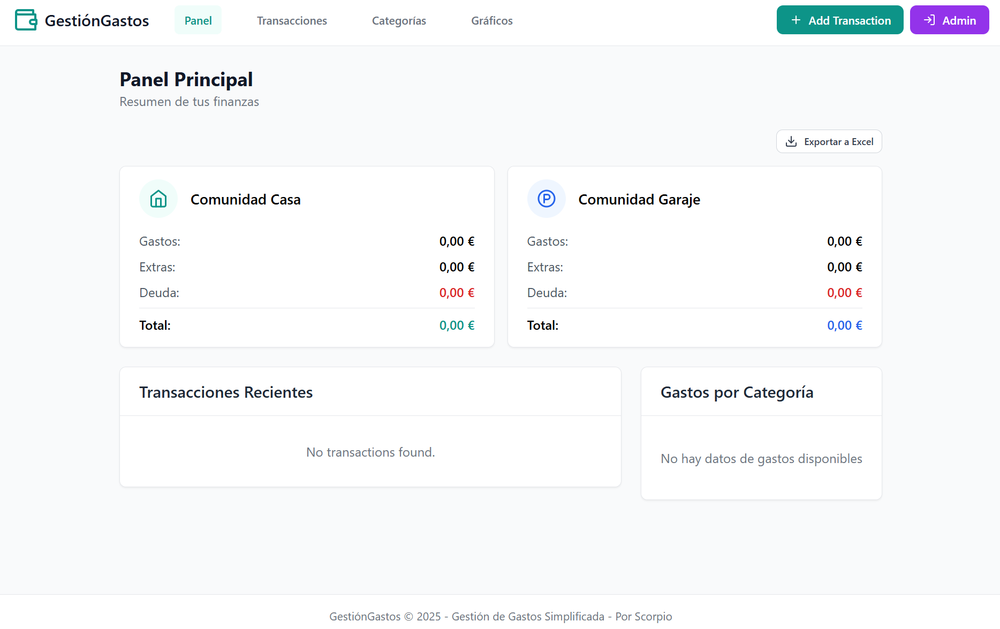
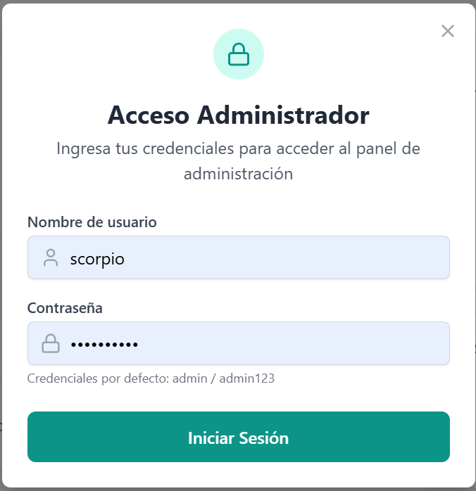

<div align="center">

# 🏠 Aplicación de Gestión de Gastos de Comunidad

[](https://reactjs.org/)
[](https://www.typescriptlang.org/)
[](https://vitejs.dev/)
[](https://www.php.net/)
[](https://www.mysql.com/)

<p>Una aplicación web moderna para gestionar gastos de comunidad, con exportación a Excel y visualización de datos.</p>

</div>

## 📸 Capturas de Pantalla

<div align="center">

### Panel Principal


### Panel de Administración


</div>

## 💻 Panel de Administración

El Panel de Administración proporciona herramientas potentes para gestionar la base de datos de la aplicación:

### Funciones Principales

- **🔄 Restaurar Categorías**: Restablece las categorías predeterminadas en caso de que hayan sido eliminadas o modificadas accidentalmente.

- **🗑️ Eliminar Transacciones Antiguas**: Permite eliminar automáticamente todas las transacciones con más de un año de antigüedad, ayudando a mantener la base de datos limpia y eficiente.

- **💾 Optimizar Base de Datos**: Ejecuta comandos de optimización en las tablas de la base de datos para mejorar el rendimiento general de la aplicación.

- **🗑️ Limpiar Base de Datos**: Elimina todos los registros de transacciones mientras preserva las tablas de usuarios y categorías. Esta función es útil para reiniciar la aplicación manteniendo la configuración básica.

### Seguridad

El acceso al Panel de Administración está protegido por autenticación, asegurando que solo los usuarios autorizados puedan realizar estas operaciones críticas.

## ✨ Características

- 💰 **Gestión de Gastos**: Registra y gestiona gastos de comunidad para casa y garaje
- 📁 **Categorización**: Organiza los gastos en diferentes categorías (Gastos, Extras, Deudas)
- 📈 **Visualización de Datos**: Gráficos interactivos para visualizar la distribución de gastos
- 📆 **Exportación a Excel**: Exporta los datos a Excel con formato mejorado (deudas en rojo)

## 💻 Tecnologías Utilizadas

### Frontend
- ⚡️ React 18.3
- 🔥 TypeScript 5.0
- ⚡ Vite 5.4
- 📊 Chart.js 4.4
- 🎨 TailwindCSS 3.4
- 📊 XLSX 0.18

### Backend
- 🔗 PHP 8.2
- 💾 MySQL 8.0
- 🌐 RESTful API

### Integración de Escritorio
- 💻 Tauri 2.5.0 (opcional)
- 💼 PowerShell (lanzador incluido)

## 📦 Requisitos Previos

- 🔍 Node.js (v14 o superior)
- 🔎 XAMPP (o cualquier servidor con PHP y MySQL)
- 💻 Navegador web moderno

## 📍 Instalación

### 1. Clona el repositorio

```bash
git clone [URL del repositorio]
cd gastos
```

### 2. Instala las dependencias

```bash
npm install
```

### 3. Configura la base de datos

1. Inicia XAMPP y asegúrate de que los servicios Apache y MySQL estén funcionando
2. Abre phpMyAdmin (http://localhost/phpmyadmin)
3. Crea una nueva base de datos llamada `gastos_app`
4. Importa el esquema de la base de datos desde `database/schema.sql`

### 4. Configura la conexión a la base de datos

Edita el archivo `api/config.php` si es necesario para ajustar los parámetros de conexión:

```php
<?php
// Configuración de la base de datos
define('DB_HOST', 'localhost');
define('DB_NAME', 'gastos_app');
define('DB_USER', 'root');
define('DB_PASS', '');
?>
```

## 🚀 Uso

### Usando el Lanzador (Recomendado)

La aplicación incluye un lanzador que facilita su ejecución en diferentes modos:

1. Ejecuta el archivo `GestionGastos.bat` haciendo doble clic en él.

2. Se abrirá una interfaz gráfica que muestra el estado de los servicios de XAMPP.

3. Elige uno de los modos de ejecución:

   - **Modo XAMPP**: Abre la aplicación en `http://localhost/duplicados/gastos/`. Requiere que los servicios Apache y MySQL estén en ejecución.
   
   - **Modo Desarrollo**: Inicia automáticamente el servidor de desarrollo con Vite y abre la aplicación en el puerto asignado. No depende de XAMPP para el desarrollo.

### Desarrollo Manual

1. Inicia el servidor de desarrollo:

```bash
npm run dev
```

2. Abre tu navegador y ve a la URL mostrada en la consola (normalmente algo como):

```
http://localhost:5173/duplicados/gastos/
```

> **Nota**: El puerto puede variar en cada ejecución. Observa la consola para ver la URL exacta.

### Producción

1. Construye la aplicación para producción:

```bash
npm run build
```

2. Configura tu servidor web:
   - Copia todos los archivos de la carpeta `dist` a la raíz de tu servidor web o a una subcarpeta
   - Copia la carpeta `api` completa al mismo nivel que los archivos de la carpeta `dist`
   - Asegúrate de que el servidor web tenga permisos de escritura en la carpeta `api`

3. Configura la URL base en producción:
   - Si estás desplegando en una subcarpeta, edita el archivo `vite.config.ts` y ajusta la propiedad `base` antes de construir:
     ```typescript
     export default defineConfig({
       // ...
       base: '/ruta/a/tu/subcarpeta/',
       // ...
     });
     ```

4. Configura el servidor web:
   - Para Apache, asegúrate de que el módulo `mod_rewrite` esté habilitado
   - Crea o edita un archivo `.htaccess` en la raíz de tu aplicación con el siguiente contenido:
     ```apache
     <IfModule mod_rewrite.c>
       RewriteEngine On
       RewriteBase /
       RewriteRule ^index\.html$ - [L]
       RewriteCond %{REQUEST_FILENAME} !-f
       RewriteCond %{REQUEST_FILENAME} !-d
       RewriteRule . /index.html [L]
     </IfModule>
     ```

## 📚 Estructura del Proyecto

```
gastos/
├── api/                      # Backend PHP
│   ├── admin/                # Funciones de administración
│   │   ├── check-auth.php      # Verificación de autenticación
│   │   ├── delete-old-transactions.php # Eliminar transacciones antiguas
│   │   ├── login.php           # Inicio de sesión de administrador
│   │   ├── optimize-database.php # Optimización de la base de datos
│   │   ├── restore-categories.php # Restaurar categorías predeterminadas
│   │   └── simple-clear-db.php  # Limpiar la base de datos
│   ├── config/               # Configuración de la base de datos
│   │   └── database.php       # Configuración de conexión a la BD
│   ├── models/               # Modelos de datos
│   │   ├── Category.php       # Modelo para categorías
│   │   └── Expense.php        # Modelo para gastos
│   ├── categories.php        # API para categorías
│   ├── config.php            # Configuración global
│   ├── expenses.php          # API para gastos
│   └── index.php             # Punto de entrada de la API
├── database/                 # Esquemas de base de datos
│   └── schema.sql            # Esquema SQL de la base de datos
├── dist/                     # Archivos de producción (generados)
├── imagen/                   # Imágenes para documentación
│   ├── panel_admin.png        # Captura del panel de administración
│   └── panel_principal.png    # Captura del panel principal
├── node_modules/             # Dependencias de Node.js
├── public/                   # Archivos estáticos públicos
├── src/                      # Código fuente de React
│   ├── components/           # Componentes de React
│   │   ├── dashboard/         # Componentes del dashboard
│   │   ├── expenses/          # Componentes de gastos
│   │   ├── layout/            # Componentes de layout
│   │   └── ui/                # Componentes de UI reutilizables
│   ├── context/              # Contextos de React
│   │   └── ExpenseContext.tsx # Contexto para gastos
│   ├── data/                 # Datos estáticos
│   ├── types/                # Definiciones de tipos TypeScript
│   │   └── tauri.d.ts         # Definiciones de tipos para Tauri
│   ├── utils/                # Utilidades
│   │   ├── api.ts             # Cliente API
│   │   ├── excel.ts           # Utilidades para exportación a Excel
│   │   ├── helpers.ts         # Funciones auxiliares
│   │   └── tauri.ts           # Funciones para interactuar con Tauri
│   ├── views/                # Vistas/Páginas
│   ├── App.tsx               # Componente principal
│   ├── index.css             # Estilos globales
│   ├── main.tsx              # Punto de entrada
│   └── vite-env.d.ts         # Definiciones de tipos para Vite
├── src-tauri/                # Configuración y código de Tauri
│   ├── Cargo.toml            # Configuración de dependencias Rust
│   ├── icons/                # Iconos para la aplicación de escritorio
│   ├── src/                  # Código fuente Rust
│   │   └── main.rs           # Punto de entrada Rust con comandos
│   └── tauri.conf.json      # Configuración de Tauri
├── .gitignore                # Archivos ignorados por Git
├── GestionGastos.bat         # Archivo batch para iniciar la aplicación
├── index.html                # Plantilla HTML principal
├── launcher.ps1              # Script PowerShell para verificar servicios
├── package.json              # Configuración de dependencias
├── postcss.config.js          # Configuración de PostCSS
├── README.md                 # Documentación del proyecto
├── tailwind.config.js         # Configuración de TailwindCSS
├── tsconfig.app.json         # Configuración principal de TypeScript
├── tsconfig.json             # Configuración de TypeScript
├── tsconfig.node.json         # Configuración de TypeScript para Node
└── vite.config.ts             # Configuración de Vite
```

## 💯 Funcionalidades Principales

### 💰 Gestión de Gastos

La aplicación permite registrar diferentes tipos de gastos:

| Categoría | Descripción |
|------------|-------------|
| 🏠 **Gastos Comunidad Casa** | Gastos regulares de la comunidad de vecinos |
| ✨ **Extras Comunidad Casa** | Gastos extraordinarios de la comunidad |
| 💳 **Deuda Comunidad Casa** | Deudas pendientes de la comunidad |
| 🚗 **Gastos Comunidad Garaje** | Gastos regulares del garaje |
| ✨ **Extras Garaje** | Gastos extraordinarios del garaje |
| 💳 **Deuda Garaje** | Deudas pendientes del garaje |

### 📆 Exportación a Excel

La aplicación permite exportar todos los datos a Excel con un formato mejorado:

- 🗂️ Hojas separadas para cada categoría
- 🔴 Deudas destacadas en rojo para mejor visualización
- 📏 Ajuste automático del ancho de las columnas
- 📈 Formato de fecha y moneda consistente

### 📈 Visualización de Datos

La aplicación incluye gráficos interactivos para visualizar:

- 🍪 Distribución de gastos por categoría
- 📉 Resumen financiero con totales
- 💵 Balance de gastos e ingresos

## 👨‍💻 Autor

Desarrollado con ❤️ por Scorpio

---

<div align="center">

💪 GestionGastos © 2025 - Gestión de Gastos Simplificada - Por Scorpio

❤️ Hecho con React + TypeScript + PHP

</div>
